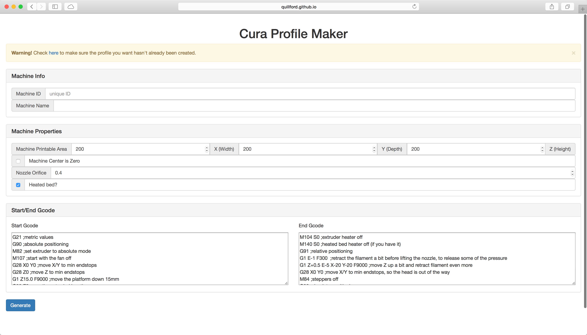
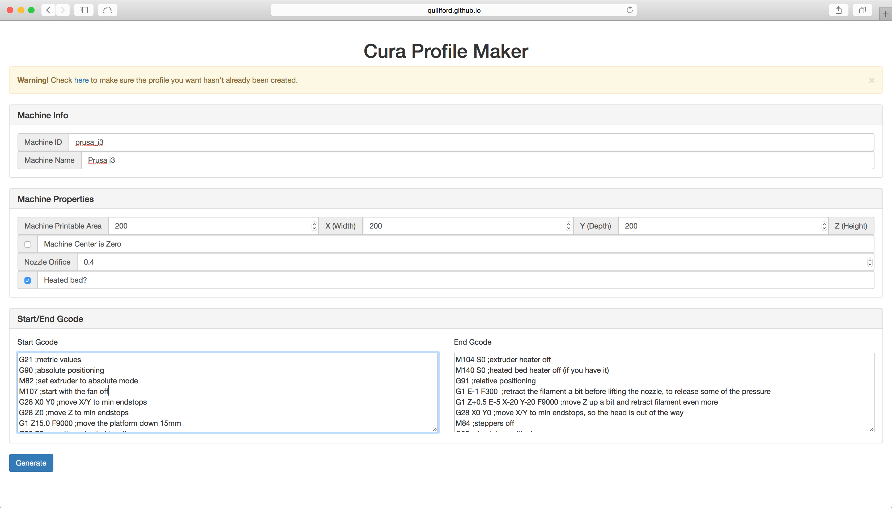
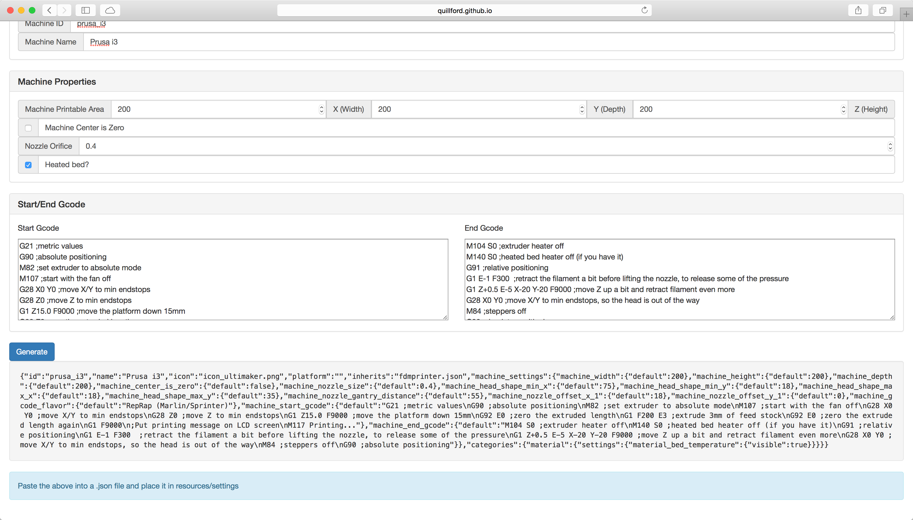

# CuraProfileMaker
a tool to make machine profiles for printers other than Ultimakers

# Example
Here is an example profile for the Prusa i3.

# Mac OS X

* Go to Cura.app
* Right click and click 'Show Package Contents'
* Navigate to Contents -> Resources -> cura -> resources -> settings
* Place the generated JSON profile in the settings folder